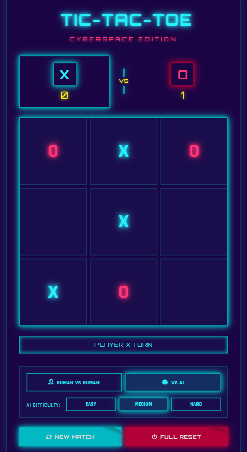

# 🎮 Tic-Tac-Toe: Cyberspace Edition

A neon-themed, cyberspace-styled Tic-Tac-Toe game built using **HTML**, **CSS**, and **JavaScript**.

## 📸 Screenshot

## 📂 Project Files

| File        | Purpose                                       |
|:------------|:------------------------------------------------|
| `index.html` | Game structure and UI layout                    |
| `styles.css` | Neon-inspired styles and layout                 |
| `script.js`  | Game logic: player turns, AI moves              |
| `game.png`   | Screenshot for README display                   |
| `README.md`  | Project description and instructions            |

## 🙋‍♀️ Author

**Ariba Arzi**  
🔗 [LinkedIn](https://www.linkedin.com/in/aribaarzi2207)  
💻 [GitHub Profile](https://github.com/your-github-handle)
